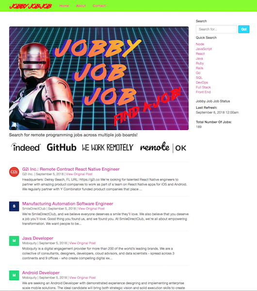

# Jobby Job Job

Heroku takes 30 seconds to load the instance. After that it's really very fast.

[https://jobbyjobjob.herokuapp.com/](https://jobbyjobjob.herokuapp.com/)

## Description

Jobby Job Job is a website that aggregates job postings from 4 different job boards.
The job boards are remote only jobs. You can specify and search for different jobs.
You can also view the original post.

Job posts are updated every hour using the Heroku scheduler to execute a rake
background task. The rake task builds the posts and creates the search indexes.

## Screenshot Time.



## Check out these job boards:

- [https://www.indeed.com](https://www.indeed.com)
- [https://jobs.github.com](https://jobs.github.com)
- [https://weworkremotely.com/](https://weworkremotely.com/)
- [https://remoteok.io/](https://remoteok.io/)

## Contributing

If you want to help me with this project by adding a feature, another job board
or fixing a bug please just submit a pull request. I will probably accept it.
If you don't then I hate you.

This is a good project to work on if you want to do [Hacktoberfest](https://hacktoberfest.digitalocean.com/) #Hacktoberfest. Check out this [issue](https://github.com/willywos/jobbyjobjob/issues/1) for some ideas or feel free to add to the list.

## Building the project

Ruby Version: ruby 2.5.1
Rails Version: 5.2.1

```
$ git clone https://github.com/willywos/jobbyjobjob.git
$ cd jobbyjobjob
$ bundle install
$ rake db:create (postgres database)
$ rake db:migrate
$ rake db:seed
$ rails s
```

## Grabbing Jobs

```
$ rake jobby_job:process_job_sites
```

## Submitting Pull Requests

1. Fork the project
2. Create a topic branch
3. Implement your feature or bug fix
4. Add tests for your feature or bug fix (if you want)
5. Run `$ rspec spec/` make sure tests pass.
6. If your change affects something in this README, please update it
7. Commit and push your changes
8. Submit a pull request
